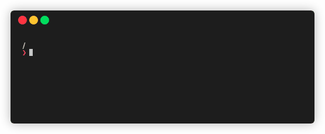

# Quik

Go somewhere, quik.



quik lets you define bookmarked directories to quickly go to.
For example:

``` shell
$ quik add "$HOME/Documents" docs
"docs" → "/home/miguelmurca/Documents"
$ quik docs
$ echo $(pwd)
/home/miguelmurca/Documents
```

## Quick Start

``` shell
git clone https://github.com/mikeevmm/quik
cd quik
bash install.sh
quik --help
```

## License

This tool is licensed under an MIT license.
See LICENSE for details.

## Support

💕 If you liked quik, consider [buying me a coffee](https://www.paypal.me/miguelmurca/2.50).
