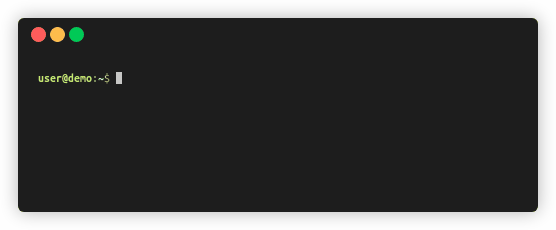

# Quik

Go somewhere, quik.



quik lets you define bookmarked directories to quickly go to.
For example:

``` shell
$ quik add docs "$HOME/Documents"
"docs" → "/home/user/Documents"
$ quik docs
$ pwd
/home/user/Documents
```

## Quick Start

``` shell
git clone https://github.com/mikeevmm/quik
cd quik
python install.py
quik --help
```

## Why Quik

quik is mostly Python. This makes its source code easier to read (as compared to something written in bash), and easier to port to other terminals (like Zsh of Fish), as only the [bash contents](internals/quik_setup.sh) need to be ported.

As a testament to this, as of version 2.3, `quik` is also compatible with Windows, via the [batch port of that file](internals/quik_setup.bat). :)

## License

This tool is licensed under an MIT license.
See LICENSE for details.

## Support

💕 If you liked quik, consider [buying me a coffee](https://www.paypal.me/miguelmurca/2.50).
